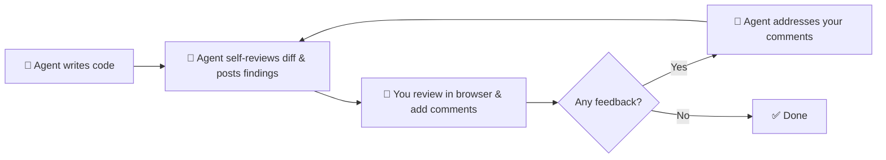

# crloop

A local code review tool for AI agent workflows. Review Git diffs in a browser UI, annotate changed lines, and feed structured comments back to the agent — all running on your machine. Currently supports Claude Code.

## How it works



The agent reviews its own changes, posts findings, and opens the browser for you. You review the diff, leave comments, and click "Finish Review". The agent reads your feedback, fixes the code, and the loop repeats until you're satisfied.

## Quick start

```bash
npm install -g crloop
```

### AI agent workflow

Install the Claude Code skill into your project:

```bash
cd /path/to/repo
crloop skill --install --scope project
```

Then ask Claude to "review my changes" or "do a code review". It handles the rest.

### Manual usage

```bash
crloop serve                         # starts the server
crloop add-repo /path/to/repo        # register a repo
cd /path/to/repo
crloop open                          # opens browser with CR of your changes in git working directory
crloop repos                         # list registered repos
crloop remove-repo <id>              # unregister a repo
```

### Stop the server

```bash
crloop stop-server
```

### Help

```bash
crloop --help
```

## Requirements

- Node.js 18+
- git in PATH
- A browser

## Uninstall

```bash
crloop stop-server
npm uninstall -g crloop
```

## Documentation

- [Usage manual](./docs/usage.md) — full CLI reference, comment storage, workflows
- [Development](./docs/development.md) — building and running from source
- [API](./docs/api.md) — HTTP API and comment file schema
