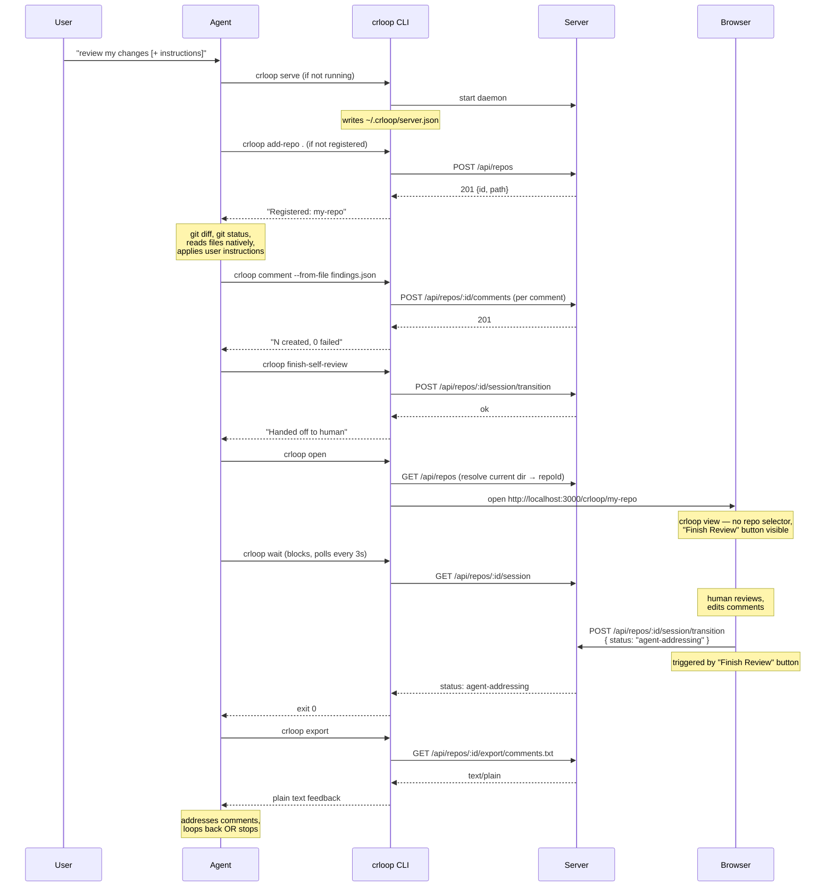

# Design: Agent Skill + CLI

## Overview

This design adds two things to enable the agent-human review loop:

1. A **CLI command layer** (`crloop <command>`) that wraps the existing HTTP API for terminal use.
2. An **Agent Skill** (`SKILL.md`) that teaches AI agents the CLI vocabulary and review loop workflow.

No new dependencies. No new transport layer. The CLI commands call the running HTTP server. The skill is a markdown file.

Requires Node.js 18+ and `git` on PATH.

## CLI Commands

The CLI is available as `crloop <command>` after global install, or `npx crloop <command>` without installing. See [distribution.md](./distribution.md) for install modes.

All commands except `serve` and `url` assume a review tool server is already running. Commands discover the server URL via:

- **Currently:** `--url` flag, falling back to `http://localhost:3000`
- **Planned:** `--url` → `CODE_REVIEW_URL` env var → lock file `~/.crloop/server.json` → default `http://localhost:3000`

The full resolution chain will be implemented alongside the lock file in the `serve` / `stop-server` completion work.

Global meta-flags (not subcommands):

```
crloop --help | -h       Print usage
crloop --version | -v    Print installed version
```

### Implementation Status

| Command | Status | Notes |
|---|---|---|
| `repos` | ✅ Implemented | |
| `add-repo` | ✅ Implemented | |
| `remove-repo` | ✅ Implemented | |
| `schema` | ✅ Implemented | Updated with all agentic commands |
| `serve` | ✅ Implemented | Idempotent; lock file written after successful bind |
| `stop-server` | ✅ Implemented | Lock file removal on stop |
| `url` | ✅ Implemented | Reads lock file, verifies PID |
| `open` | ✅ Implemented | Opens `/crloop/<repoId>` view cross-platform |
| `comment` | ✅ Implemented | Single + bulk (`--from-file`) + `--dry-run` |
| `export` | ✅ Implemented | Plain text to stdout, `--file` filter |
| `status` | ✅ Implemented | Human-readable + `--json` |
| `finish-self-review` | ✅ Implemented | Transitions to `human-review`, `--dry-run` |
| `wait` | ✅ Implemented | Polls session, exit 0/2 |

> **Why no `changes` or `diff` commands?** The agent runs inside the git repository it is reviewing and already has `git status`, `git diff`, and file-reading tools. There is no value in routing diffs through the crloop server and back. The agent reviews changes natively; crloop is only used to record findings and coordinate with the human.

---

## Implemented Commands

### `crloop repos`

List repos registered with the running server.

```
crloop repos [--url URL] [--json]
```

Default output (human-readable):
```
my-api   /path/to/api
frontend /path/to/frontend
```

With `--json`: raw JSON array from `GET /api/repos`.

### `crloop add-repo`

Register a repo with the running server at runtime.

```
crloop add-repo <path> [--id <repoId>] [--url URL] [--json] [--dry-run]
```

Calls `POST /api/repos`. The repo ID is derived from the directory basename (lowercased, non-alphanumeric → `-`) unless overridden with `--id`. Use `--dry-run` to preview the derived ID without registering.

### `crloop remove-repo`

Unregister a repo from the running server.

```
crloop remove-repo <repoId> [--url URL] [--json] [--dry-run]
```

Calls `DELETE /api/repos/:repoId`. Use `--dry-run` to preview without removing.

### `crloop schema`

Print machine-readable JSON schema for all commands or a single command.

```
crloop schema [command]
```

---

### `crloop serve`

Start the review server. Default command when no subcommand is given. Spawns a detached daemon and exits.

**Idempotent:** if a live server is already running on the same port (detected via lock file PID check), prints `Server running (pid X) on http://localhost:PORT` and exits 0 without spawning a second daemon.

```
crloop serve [--repo <path>] [--repo name:<path>] [--port 3000]
```

Multiple `--repo` flags register multiple repos at startup. Use `name:/path` syntax for an explicit ID:

```
crloop serve --repo fe:/path/to/frontend --repo be:/path/to/backend
```

Output (both first run and idempotent re-run):
```
Server running (pid 12345) on http://localhost:3000
```

### `crloop stop-server`

Stop the running server.

```
crloop stop-server [--url URL] [--json]
```

Outputs `Server stopped.` or `{"stopped": true}` with `--json`. Removes `~/.crloop/server.json` on success.

---

## Planned Commands (Agentic Workflow)

Repo-targeting commands (`open`, `comment`, `finish-self-review`, `wait`, `export`, `status`) accept `--repo <repoId>` to target a specific repo when multiple repos are registered. When `--repo` is omitted and the current working directory matches a registered repo path, it is selected automatically. Server-level commands (`url`) do not take `--repo`.

### `crloop url`

Print the base URL of the running server. Reads the lock file — no network call.

```
crloop url [--json]
```

Output:
```
http://localhost:3000
```

With `--json`: `{"url": "http://localhost:3000", "port": 3000, "pid": 1234}`.

Exits with code 1 if the lock file does not exist or the server process is no longer running. Used by agents and scripts to discover the server URL without hardcoding the port.

### `crloop open`

Open the review UI in the default browser, pointing at the correct repo.

```
crloop open [--repo <repoId>] [--url URL]
```

Reads the server URL from the lock file (or `--url`). If `--repo` is omitted, matches the current working directory against registered repos via `GET /api/repos`. Opens the browser cross-platform (`open` on macOS, `xdg-open` on Linux, `start` on Windows). Validates that the server is reachable before opening.

Opens `http://localhost:<port>/crloop/<repoId>` — the **crloop view** (see [crloop View UI](#crloop-view-ui) below). This is distinct from the root `http://localhost:<port>` which shows the standard UI unchanged.

### `crloop comment`

Add a comment to a changed line.

```
crloop comment \
  --file src/server/server.ts \
  --side new \
  --line 42 \
  --body "Extract this into a helper function"
  [--repo <repoId>] [--url URL] [--dry-run]
```

Calls `POST /api/repos/:repoId/comments`. Prints the created comment ID on success.

`--side` is `new` for added/modified lines, `old` for removed lines.

With `--dry-run`: validates that `--file` resolves to a known `changeId`, `--side` is `new` or `old`, and `--line` is a positive integer — without writing anything. Reports what would be created.

### `crloop comment --from-file <path>`

Bulk-import comments from a JSON file. Preferred over single-comment calls when the agent produces multiple findings at once.

```
crloop comment --from-file comments.json [--repo <repoId>] [--url URL] [--dry-run]
```

The JSON file format:
```json
[
  {
    "file": "src/server/server.ts",
    "side": "new",
    "line": 42,
    "body": "Extract this into a helper function"
  },
  {
    "file": "src/server/server.ts",
    "side": "new",
    "line": 55,
    "body": "Add error handling here"
  }
]
```

The command resolves each `file` to a `changeId`, then calls `POST /api/repos/:repoId/comments` for each entry. Reports success/failure per comment.

### `crloop finish-self-review`

Agent signals it has finished self-review and hands off to the human.

```
crloop finish-self-review [--repo <repoId>] [--url URL] [--dry-run]
```

Calls `POST /api/repos/:repoId/session/transition` with `{ "status": "human-review" }`. Prints confirmation.

With `--dry-run`: validates that the session is in `agent-review` state and reports the transition that would occur, without calling the endpoint.

Requires `POST /api/repos/:repoId/session/transition` — not yet implemented (session coordination phase).

### `crloop wait`

Block until the human finishes review.

```
crloop wait [--repo <repoId>] [--url URL] [--poll-interval 3]
```

Polls `GET /api/repos/:repoId/session` every N seconds. Exits when status changes to `agent-addressing` or `complete`. Exit code 0 if `agent-addressing` (feedback to address), exit code 2 if `complete` (no comments, done).

This is the only blocking command. It replaces the need for the agent to implement its own polling loop.

Requires session endpoints — not yet implemented.

### `crloop export`

Export all comments as plain text.

```
crloop export [--repo <repoId>] [--url URL] [--file <path>]
```

Prints the export to stdout. From `GET /api/repos/:repoId/export/comments.txt`.

`--file` restricts output to comments on a single file. Reduces token cost when the agent is addressing feedback on one file at a time and doesn't need the full export.

### `crloop status`

Show review session status.

```
crloop status [--repo <repoId>] [--url URL] [--json]
```

Default output:
```
Status:     human-review
Iteration:  2
Comments:   5 current, 1 outdated
Head:       b58557fe1d0
```

With `--json`: raw JSON from `GET /api/repos/:repoId/session`.

Requires `GET /api/repos/:repoId/session` — not yet implemented (session coordination phase).

---

## crloop View UI

The URL `http://localhost:<port>/crloop/<repoId>` renders a focused review view for the human reviewer. It is opened by `crloop open` and is the canonical entry point for the human leg of the review loop.

### Behavior

- **Same diff/comment functionality** as the standard UI — file tree, diff viewer, inline comments, export.
- **No repository selector** — the repo is fixed by the URL; switching repos requires a different URL. The `RepoSelector` component is hidden.
- **"Finish Review" button** — replaces or complements the standard export controls. When clicked, calls `POST /api/repos/:repoId/session/transition` with `{ "status": "agent-addressing" }`, signalling the agent (blocked on `crloop wait`) to unblock and read feedback.

### Standard view preserved

Navigating to `http://localhost:<port>` (root) shows the existing UI with no changes. The repo selector, all controls, and existing UX are fully preserved. The crloop view is additive — it lives on a separate path.

### Implementation notes

The Express server already serves `index.html` for all non-API paths via the catch-all route `app.get("/{*path}", ...)`. No server-side routing changes are needed.

Client-side detection in `main.tsx` or `App.tsx`:

```ts
const crloopMatch = /^\/crloop\/([^/]+)/.exec(window.location.pathname);
const crloopRepoId = crloopMatch?.[1] ?? null;
```

When `crloopRepoId` is set:
- Pass `crloopRepoId` to `RepoProvider` to auto-select the repo (skip the selector).
- Suppress `<RepoSelector />` rendering.
- Render a **"Finish Review"** button in the toolbar that calls the session transition endpoint.

When `crloopRepoId` is null (standard view), behavior is unchanged.

---

## Implementation

### Entry Point: `src/server/cli.ts`

Existing file. Parses `process.argv` to dispatch to the correct command handler. Each command is a function that:
1. Resolves the server URL (`--url` → `CODE_REVIEW_URL` → lock file → default)
2. Makes HTTP request(s) to the running server
3. Formats and prints output
4. Sets exit code

The file starts with `#!/usr/bin/env node` for npm bin linking.

### Lock File: `~/.crloop/server.json`

`crloop serve` writes a lock file after the daemon successfully binds the port; `crloop stop-server` removes it. Before spawning, `serve` reads the lock file and checks whether the recorded PID is still alive — if so it prints `Server running` and exits 0 without spawning a second process. This allows any subsequent command to discover the server URL without `--url`.

```json
{
  "port": 3000,
  "pid": 12345,
  "startedAt": "2026-03-22T10:00:00.000Z"
}
```

`crloop url` reads this file and verifies the PID is still alive before reporting the URL. All other commands use the same resolution logic but fall back to the default port rather than erroring if the file is absent.

### Repo Auto-Detection

All agentic commands that target a specific repo (`comment`, `open`, `export`, `status`, `finish-self-review`, `wait`) must resolve the repo before making any API call. Resolution order:

1. `--repo <repoId>` flag — use as-is (after validation)
2. CWD match — call `GET /api/repos`, compare `process.cwd()` against each registered repo's `path`, pick the match
3. No match — print error to stderr and exit 1

```ts
async function resolveRepoId(args: string[], baseUrl: string): Promise<string> {
  const explicit = getFlag(args, "--repo");
  if (explicit) return explicit;

  const result = await apiFetch(`${baseUrl}/api/repos`, "GET");
  const repos = result.data as Array<{ id: string; path: string }>;
  const cwd = process.cwd();
  const match = repos.find((r) => cwd === r.path || cwd.startsWith(r.path + "/"));
  if (!match) {
    console.error("Cannot detect repo from current directory. Use --repo <repoId>.");
    console.error(`Registered repos: ${repos.map((r) => r.id).join(", ") || "(none)"}`);
    process.exit(1);
  }
  return match.id;
}
```

This function is called at the top of every agentic command handler, before any other API call.

### Input Validation

The CLI validates all agent-supplied inputs before making HTTP calls. Agents hallucinate predictably; the CLI is the last line of defense before bad data reaches the server.

| Input | Check |
|---|---|
| `--file` | No `..` path segments; must be a relative path |
| `--side` | Must be exactly `new` or `old` |
| `--line` | Must be a positive integer |
| `--repo` | Alphanumeric and hyphens only; no `?`, `#`, `%` |
| `changeId` | No embedded query params (`?`, `#`, `%`) |

Validation errors print a clear message and exit with code 1 without making any HTTP request.

### Registration: `package.json`

```json
{
  "name": "crloop",
  "private": false,
  "bin": {
    "crloop": "dist/server/server/cli.js"
  },
  "files": [
    "dist/server",
    "dist/client",
    "skill"
  ],
  "prepublishOnly": "npm run build && npm test"
}
```

### Runtime: tsc-compiled Node.js

The CLI is compiled by the existing `tsc -p tsconfig.server.json` alongside the server code. Uses only Node.js built-ins:
- `node:fs`, `node:path`, `node:child_process`, `node:url` for serve/daemonization and lock file
- Global `fetch()` for HTTP calls (Node.js 18+)
- No additional dependencies

### New Server Endpoints Required (for agentic commands)

- `GET /api/repos/:repoId/session` — session status (status, iteration, head, comment counts)
- `POST /api/repos/:repoId/session/transition` — transition session state

These will be implemented as part of the session coordination phase. All other planned commands use existing endpoints.

## SKILL.md

The skill file is at `skill/SKILL.md` in the project root and is included in the published npm tarball (via the `files` whitelist). Users copy it to their agent's skill directory after install. See [distribution.md](./distribution.md#skill-distribution) for distribution details.

The SKILL.md will be finalized once the agentic CLI commands are implemented.

See [skill/SKILL.md](./skill/SKILL.md) for the current draft content.

## Workflow Sequence (Planned)

The agent runs **inside** the repository it is reviewing and uses its native git and file tools to read diffs — no crloop commands are needed for that step. crloop is used only for startup, recording findings, coordinating handoff, and reading feedback.


